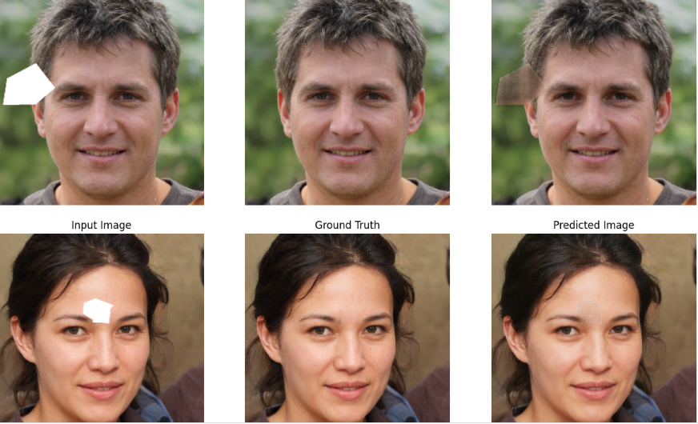

# 🖼️ Image Inpainting Using GAN

This project focuses on **image inpainting** — the task of filling in missing or corrupted regions in images using **Generative Adversarial Networks (GANs)**.

## 🔍 Project Overview

* Implemented an end-to-end GAN-based solution for **image completion**.
* Masked parts of input images during training to simulate missing regions.
* Trained the model to **reconstruct the masked areas** using the context from the remaining pixels.
* Evaluated the inpainted results on unseen test images.

---

## 🧠 Techniques Used

* **Generative Adversarial Networks (GANs)** for generating realistic completions.
* **Masking augmentation** to simulate missing data.
* **Convolutional Neural Networks (CNNs)** for both generator and discriminator.

---

## 🗂️ Dataset

We used the **[Face Mask Lite Dataset](https://www.kaggle.com/datasets/prasoonkottarathil/face-mask-lite-dataset)**.

### 🔧 Preprocessing

* Resized all images to `128x128`.
* Random square masks (e.g., 32x32) were applied at different positions on each image.
* The masked images were used as input, and original images served as ground truth.

## 🧪 Model Structure

* **Generator**: Takes a masked image and predicts the missing part.
* **Discriminator**: Judges whether the inpainted image looks real or fake.
* Trained using **adversarial loss** + **reconstruction loss (L1)**.

---

## 📸 Sample Output

## 📈 Results

The model successfully learns to reconstruct visually coherent images and is robust to varying mask positions and sizes.

